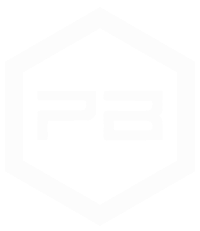

<a name="readme-top"></a>

<div align="center">
  
  <br/>
</div>

# 📗 Table of Contents

- [📖 About the Project](#about-project)
  - [🛠 Built With](#built-with)
  - [🚀 Live Demo](#live-demo)
- [💻 Getting Started](#getting-started)
  - [Setup](#setup)
  - [Prerequisites](#prerequisites)
  - [Install](#install)
  - [Usage](#usage)
- [🤝 Contributing](#contributing)
- [⭐️ Show your support](#support)
- [📝 License](#license)


# 📖 [My Portfolio] <a name="about-project"></a>

**Welcome to my portfolio!**  As a full stack web developer, I create modern web applications with stunning user interfaces and robust back-end functionality. Browse through my projects to see the diverse range of web applications I've developed. If you have any questions or would like to discuss potential collaborations, please don't hesitate to reach out. Thank you for visiting my portfolio!

## 🛠 Built With <a name="built-with"></a>


## 💻 Getting Started <a name="getting-started"></a>

To get a local copy up and running, follow these steps.

### Prerequisites

In order to run this project you need:

- node & npm installed
- Any terminal & code editor

### Setup

Clone this repository to your desired folder:

```sh
  cd my-folder
  git clone git@github.com:Peter1907/portfolio-v2.git
```
Or download the [zip](https://github.com/Peter1907/portfolio-v2/archive/refs/heads/dev.zip) file 

### Install

Install this project with:

- In the terminal, navigate to the repository directory (where you downloaded it)
```sh
  cd my-project
```
- Install dependencies
```sh
  npm i
```
### Usage

To run the project, execute the following command:

```sh
  npm run dev
```
You can specify the port following this example:
```sh
  PORT=3002 npm run dev
```

<p align="right">(<a href="#readme-top">back to top</a>)</p>

## 🚀 Live Demo <a name="live-demo"></a>

- [Live Demo Link](https://google.com)

<p align="right">(<a href="#readme-top">back to top</a>)</p>

## 🤝 Contributing <a name="contributing"></a>

Contributions, issues, and feature requests are welcome!

Feel free to check the [issues page](https://github.com/Peter1907/portfolio-v2/issues).

<p align="right">(<a href="#readme-top">back to top</a>)</p>

## ⭐️ Show your support <a name="support"></a>

If you like this project, leave star or share

<p align="right">(<a href="#readme-top">back to top</a>)</p>

## 📝 License <a name="license"></a>

This project is [MIT](./LICENSE) licensed.

You can use parts of the code with attribution.

<p align="right">(<a href="#readme-top">back to top</a>)</p>
